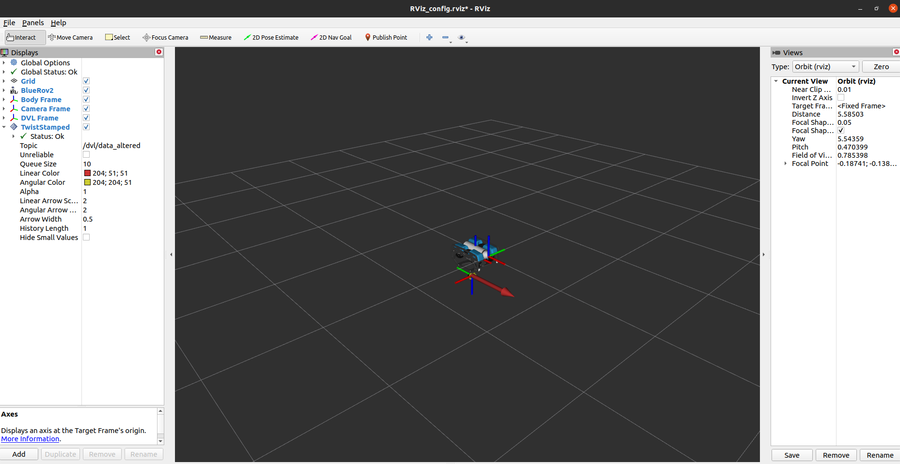
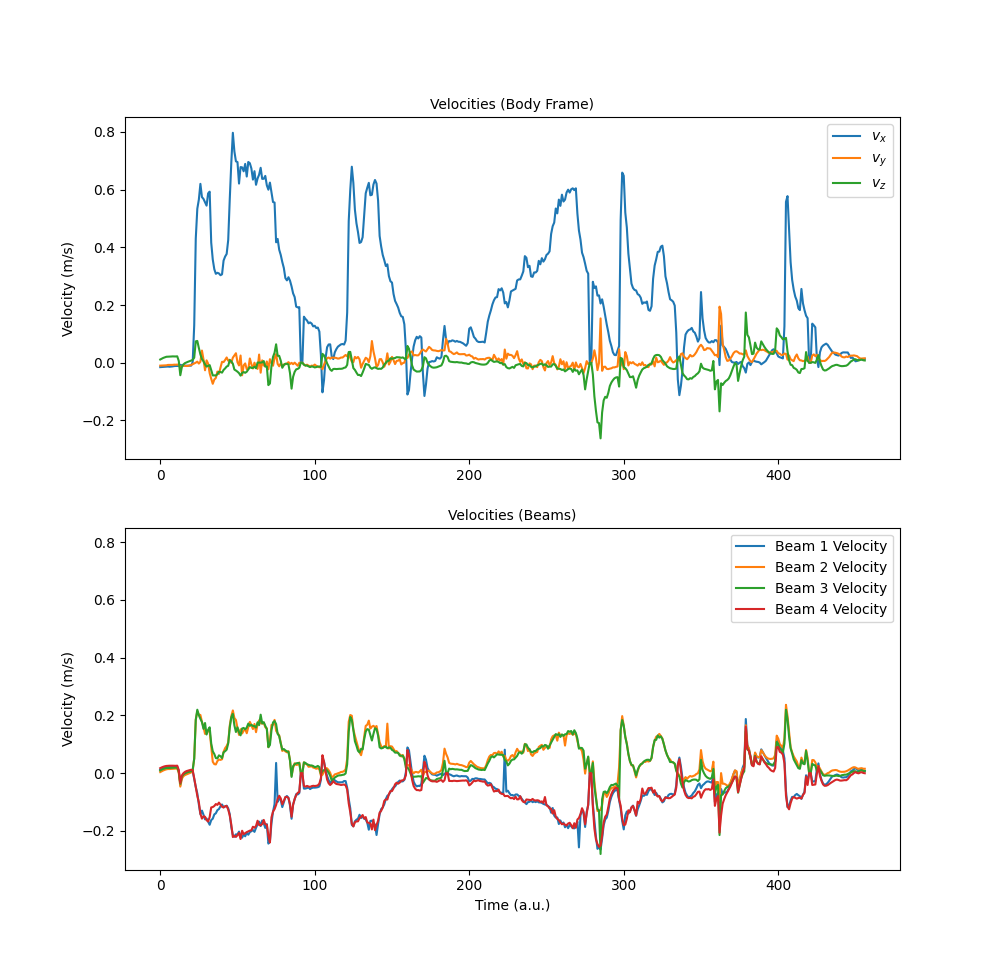

# Water Linked DVL A50 - ROS Package
A ROS package for the Water Linked DVL A50. Along with a subscribing client for easy visualization of the communication through ROS.

Water Linked A50 is, by far, the world's smallest commercially available Doppler Velocity Log. With the record-breaking 5 cm min altitude measurability, the A50 is extremely useful for working with tools close to the seabed.


### Prerequisites
The package has been tested with ROS Kinetic, and should work with most distros of ROS. Although using it with distros older than Hydro may require some tweeking. The package is coded in Python for easier readability, as such you would need to have Python installed. Preferably Python 2.7 as some distros of ROS doesn't support Python 3.

## Installation
Assuming you created your catkin workspace at the default location. And have git installed. The below steps should work:
```bash
cd ~/catkin_ws/src
git clone-b master https://github.com/waterlinked/dvl-a50-ros-driver.git
cd ~/catkin_ws
catkin_make
```

### Usage
Find the DVLs IP address. Once that's done, the package and it's components can be run by following these steps:

**To run the publisher that listens to the TCP port and sends the data to ROS**
```bash
rosrun waterlinked_a50_ros_driver publisher.py _ip:=TCP_IP
```

where TCP_IP should be replaced by the IP of the DVL. You can also display the raw DVL data in the terminal by specifying the argument "do_log_data":

**To run the publisher that listens to the TCP port, displays the raw data in the DVL and sends the data to ROS**
```bash
rosrun waterlinked_a50_ros_driver publisher.py _ip:=TCP_IP _do_log_data:=true
```

**To run a subscriber node that listens to the DVL topic. Helpful for debugging or checking if everything is running as it should be. Choose between "subscriber_gui.py" and "subscriber.py". The GUI makes reading data visually much easier. While the non-GUI version makes it easier to read through the code to see how you can implement code yourself.**
```bash
rosrun waterlinked_a50_ros_driver subscriber_gui.py
```


## Documentation
The node publishes data to the topics: "*dvl/json_data*" and "*dvl/data*".
* *dvl/json_data*: uses a simple String formated topic that publishes the raw json data coming from the DVL.
* *dvl/data*: Uses a custom message type that structures the parsed data following our protocol. Read more about the protocol here: [DVL Protocol](https://waterlinked.github.io/docs/dvl/dvl-protocol/)


*The graph illustrates the topics and nodes created when the package is run.*


## UM Field Robotics Group Improvements
### Visualization with RViz
Tested with ROS Noetic. Run 
```
roslaunch waterlinked_a50_ros_driver visualization.launch
```

#### Potential Issues
* The visualization for Twist messages cuts off on a certain threshold. The current RViz configuration has that threshold disabled, but might need to check and unckeck the `Hide Small Values` box under the `TwistStamped` dropdown.


### Plotting DVL Values from rosbag
Tested with ROS Noetic. Run 
```
rosrun waterlinked_a50_ros_driver plot_dvl_vels.py _bag:={NAME_OF_BAG_FILE}
```

